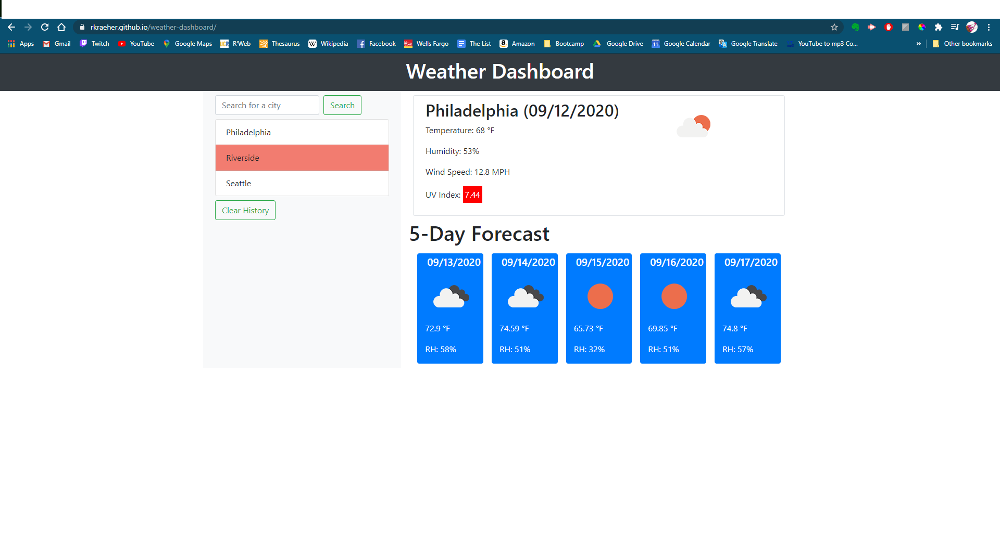

# Weather-Dashboard

## Description
    A web app to display weather information for a search city provided by the user.
    
## Table of Contents 
1. [Installation](#installation)
2. [Usage](#usage)
3. [License](#license)
4. [Contributing](#contributing)
5. [Tests](#tests)
6. [Questions](#questions)
    
## Installation
The application can be used directly in the browser by visiting the following url: https://rkraeher.github.io/weather-dashboard/

## Usage
When the page loads, users may type in a city in the search box to display current weather information for that city as well as a five-day forecast. All searches are saved in local storage and displayed below the search box.

## Technologies
The app is built with HTML and CSS using Bootstrap. It is powered by JavaScript and jQuery and gathers
weather data from the OpenWeather API. 

## Demo

  
    

## License 
  
Copyright (c) 2020 Rudi Kraeher
    
## Contributing
If you want to contribute please send me an email.
    
## Tests
At this time I have no instructions for testing the project.
    
## Questions
If you have any questions about the repo you can email me at rudikraeher@gmail.com.  
Visit my [GitHub](https://github.com/rkraeher) to see more of my work.
